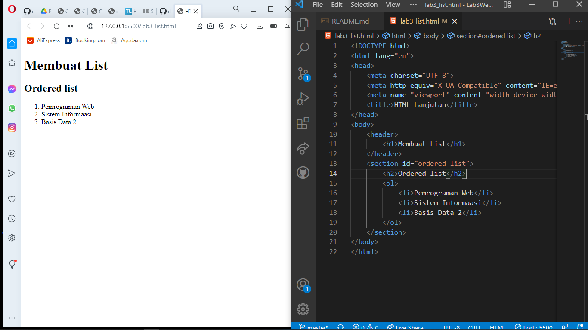
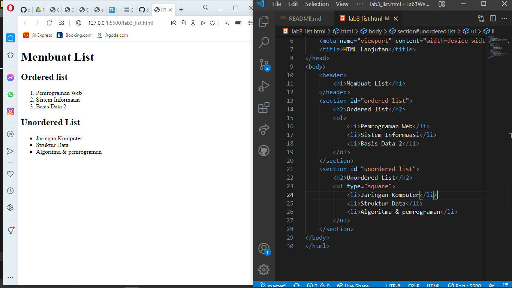
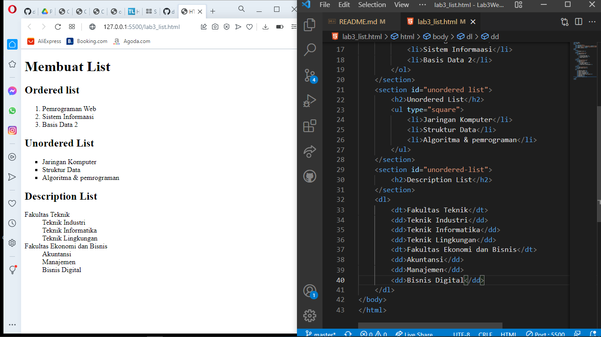
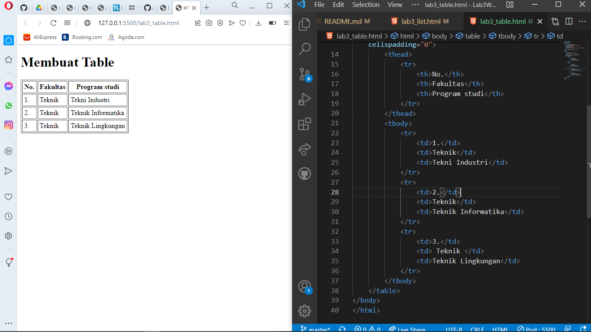
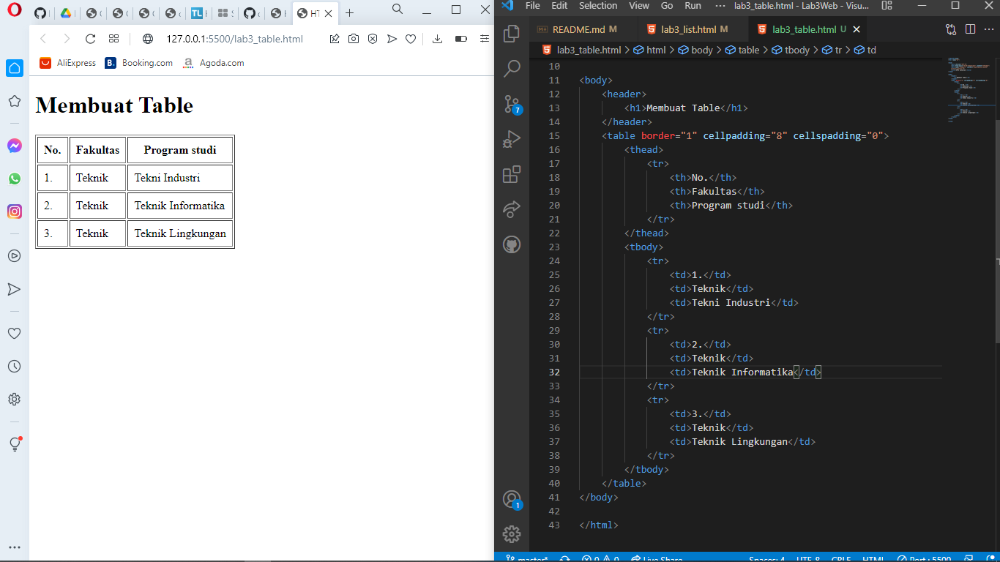
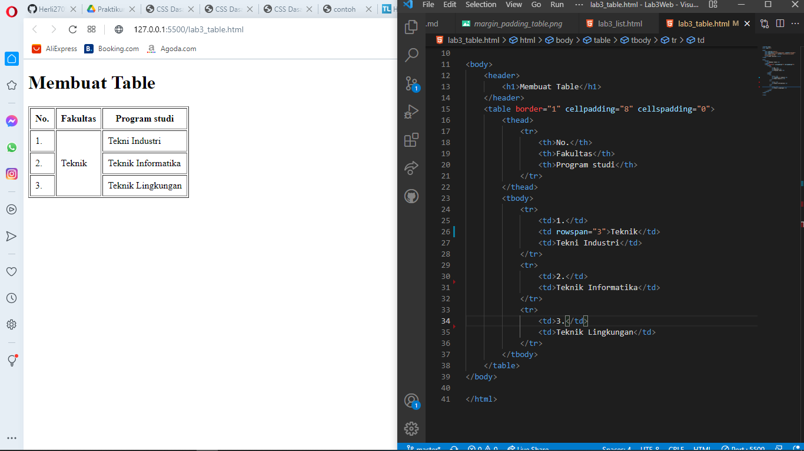
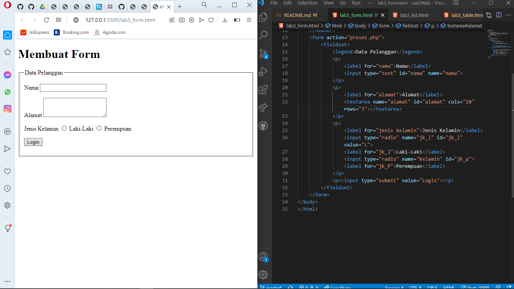
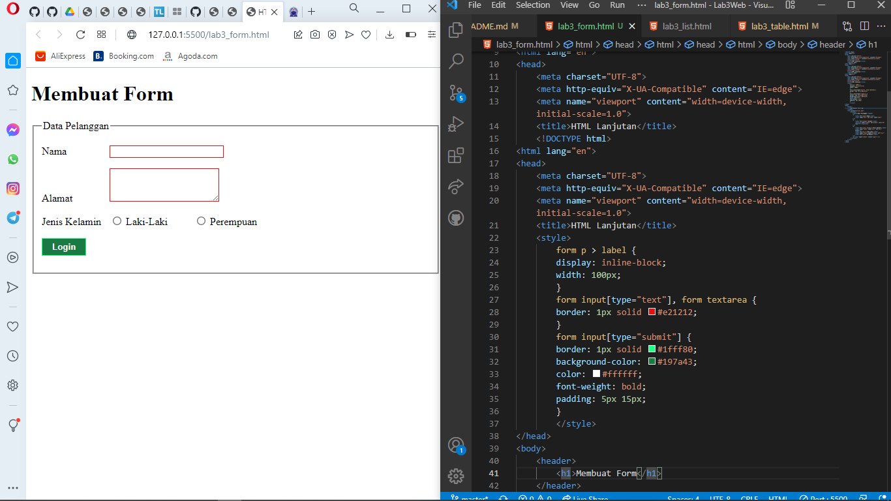

| Devi Silma Yuniar     |   TI.20.A.2       |
|--------------------   | ----------------- |
| PEMROGRAMAN WEB       |   PERTEMUAN 4     |

## PERTEMUAN 4
 kali ini kita membahas tentang membuat ***list*** ***table*** dan ***form***

 ## LAB3 WEB

 ## 1). MEMBUAT ORDERED LIST
 ### CODE DAN TAMPILAN DI HASIL NYA
 

 **deskripsi penjelasan**

 ***ordered list*** adalah list yang terurut atau tersusun secara rapih seperti orderan menu dengan di awali tag **ol** 

 **code**
 ```html
<header>
        <h1>Membuat List</h1>
    </header>
    <section id="ordered list">
        <h2>Ordered list</h2>
        <ol>
            <li>Pemrograman Web</li>
            <li>Sistem Informaasi</li>
            <li>Basis Data 2</li>
        </ol>
    </section>
 ```

 ## 2). MEMBUAT UNORDERED LIST

 ### CODE DAN TAMPILAN HASIL NYA
 

 **penjelasan**

***unorderedlist** adalah list yang tidak terurut atau list yang sifat nya acak dengan pengawalan code **ul** **unordered list**

**code**
```html
<section id="unordered list">
        <h2>Unordered List</h2>
        <ul type="square">
            <li>Jaringan Komputer</li>
            <li>Struktur Data</li>
            <li>Algoritma & pemrograman</li>
        </ul>
    </section>
```

## 3).MEMBUAT DESCRIPTION LIST

## COONTOH CODE DAN HASIL TAMPILAN NYA



**penjelasan**

**Description list** adalah description list yang urutan nya yaitu **dl** sebagai list sebuah deskripsi kemudian **dt** sebagai sebuah istilah dari penjelasan sedangkan **dd** adalah deskripsi nya atau penjelasan nya.

**code**
```html
<section id="unordered-list">
        <h2>Description List</h2>
        <dl>
            <dt>Fakultas Teknik</dt>
            <dd>Teknik Industri</dd>
            <dd>Teknik Informatika</dd>
            <dd>Teknik Lingkungan</dd>
            <dt>Fakultas Ekonomi dan Bisnis</dt>
            <dd>Akuntansi</dd>
            <dd>Manajemen</dd>
            <dd>Bisnis Digital</dd>
        </dl>
    </section>
```
## 4). MEMBUAT TABLE HTML

### CODE DAN HASIL TAMPILAN NYA



**penjelasan**

dalam membuat ***table*** urutan codingan nya adalah deklarasikan dengan tag **table** lalu panggil tag **thead** yang kemudian **th** untuk table head dan kemudian **tbody** dan **td** untuk table data atau penjelasan.

**code**

```html
<!DOCTYPE html>
<html lang="en">

<head>
    <meta charset="UTF-8">
    <meta http-equiv="X-UA-Compatible" content="IE=edge">
    <meta name="viewport" content="width=device-width, initial-scale=1.0">
    <title>HTML Lanjutan</title>
</head>

<body>
    <header>
        <h1>Membuat Table</h1>
    </header>
    <table border="1" cellpadding="4" cellspadding="0">
        <thead>
            <tr>
                <th>No.</th>
                <th>Fakultas</th>
                <th>Program studi</th>
            </tr>
        </thead>
        <tbody>
            <tr>
                <td>1.</td>
                <td>Teknik</td>
                <td>Tekni Industri</td>
            </tr>
            <tr>
                <td>2.</td>
                <td>Teknik</td>
                <td>Teknik Informatika</td>
            </tr>
            <tr>
                <td>3.</td>
                <td>Teknik</td>
                <td>Teknik Lingkungan</td>
            </tr>
        </tbody>
    </table>
</body>

</html>
```
## 5).MENAMBAHKAN MARGIN DAN  PADDING DI TABLE

Sebelum nya saya **cellpadding:"4** dan **cellspadding:"0** 
contoh!
```html
<table border="1" cellpadding="4" cellspadding="0">
```
yang kemudian di ubah menjadi contoh gambar dibawah!
```html
<table border="1" cellpadding="8" cellspadding="0">
```
**tampilan browser**


**penjelasan**

agar terlihat lebih ke dalam dan rapih.

## 6). MENGGABUNGKAN SELL DATA

## CODE DAN HASIL NYA


**penjelasan**

untuk menggabungkan sell data gunakan **rowspan** dan tentukan value untuk perubahan nya.

```html
<table border="1" cellpadding="8" cellspadding="0">
        <thead>
            <tr>
                <th>No.</th>
                <th>Fakultas</th>
                <th>Program studi</th>
            </tr>
        </thead>
        <tbody>
            <tr>
                <td>1.</td>
                <td rowspan="3">Teknik</td>
                <td>Tekni Industri</td>
            </tr>
            <tr>
                <td>2.</td>
                <td>Teknik Informatika</td>
            </tr>
            <tr>
                <td>3.</td>
                <td>Teknik Lingkungan</td>
            </tr>
        </tbody>
    </table>
```
## 7). MEMBUAT FORM HTML

### CONTOH HASIL DAN CODE



**penjelasan**

dalam membuat form perintah html code nya adalah form yang kemudian di ikuti input sesuai kebutuhan dalam client pembuatan.

**code**
```html
<!DOCTYPE html>
<html lang="en">
<head>
    <meta charset="UTF-8">
    <meta http-equiv="X-UA-Compatible" content="IE=edge">
    <meta name="viewport" content="width=device-width, initial-scale=1.0">
    <title>HTML Lanjutan</title>
    <style>
        
    </style>
</head>
<body>
    <header>
        <h1>Membuat Form</h1>
    </header>
    <form action="proses.php">
        <fieldset>
            <legend>Data Pelanggan</legend>
            <p>
                <label for="nama">Nama</label>
                <input type="text" id="nama" name="nama">
            </p>
            <p>
                <label for="alamat">Alamat</label>
                <textarea name="alamat" id="alamat" cols="20" rows="3"></textarea>
            </p>
            <p>
                <label for="jenis kelamin">Jenis Kelamin</label>
                <input type="radio" name="jk_l" id="jk_l" value="L">
                <label for="jk_l">Laki-Laki</label>
                <input type="radio" name="kelamin" id="jk_p">
                <label for="jk_P">Perempuan</label>
            </p>
            <p><input type="submit" value="Login"></p>
        </fieldset>
    </form>
</body>
</html>
```

## 8). MEMBUAT STYLE INTERNAL CSS

### CODE DAN HASIL NYA


disini saya sedikit menambahkan file internal css

**code**
```css
<style>
        form p > label {
        display: inline-block;
        width: 100px;
        }
        form input[type="text"], form textarea {
        border: 1px solid #e21212;
        }
        form input[type="submit"] {
        border: 1px solid #1fff80;
        background-color: #197a43;
        color: #ffffff;
        font-weight: bold;
        padding: 5px 15px;
        }
        </style>
```

##  PERTANYAAN DAN TUGAS!

## 1). BUATLAH FORM  YANG MENAMPILKAN **DROPDOWN** MENU DAN ***LISTBOX MULTIPLE SELECTION***
